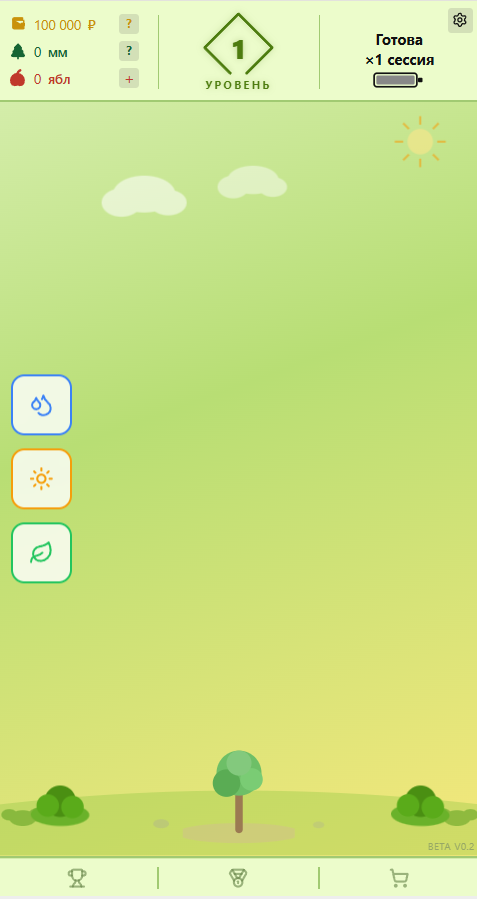
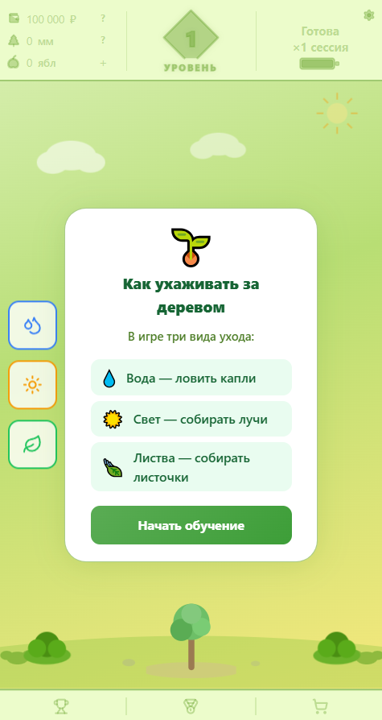
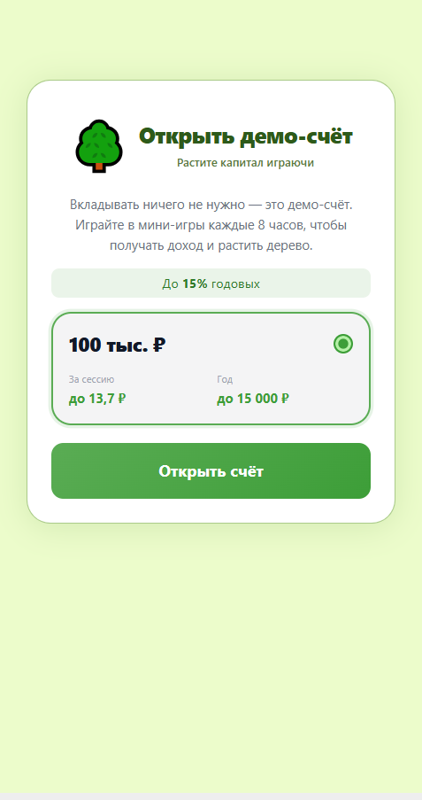
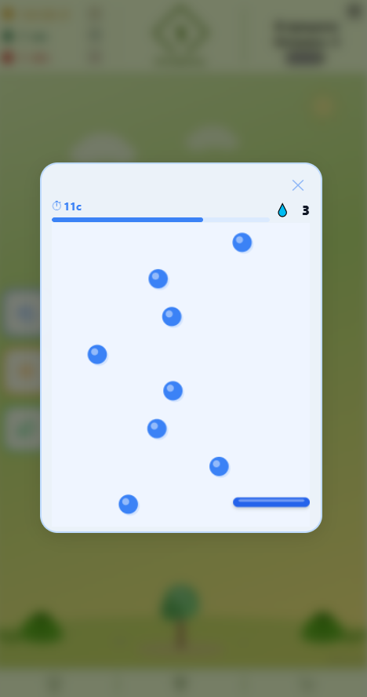
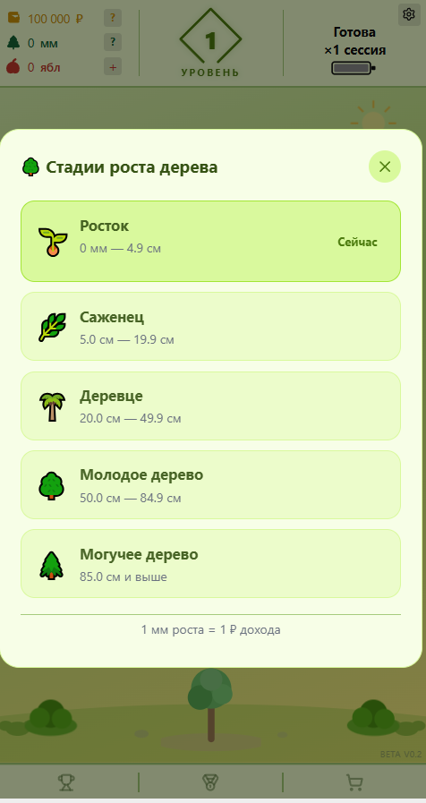

# 🌳 Росток

> Геймифицированный банковский симулятор, в котором виртуальное дерево растёт по мере роста капитала. Проходите сессии, играйте в мини-игры, собирайте награды — и возвращайтесь каждые 8 часов, чтобы видеть прогресс.

---

## Зачем это сделано

Большинство сберегательных приложений не дают ощущения прогресса: деньги лежат на счёте, проценты капают незаметно, связь между действиями и результатом слишком слаба.

«Росток» отвечает на вопрос: **а что, если рост капитала ощущался бы как уход за живым садом?**

В реальной жизни люди сигнализируют об уровне через то, что их окружает. «Росток» переносит эту динамику в цифровое пространство: ваше дерево видно другим, отражает реальные усилия и дисциплину — и его нельзя купить, только вырастить.

Проект — исследование полноценного игрового цикла: перезарядка сессий, деградирующие бонусы, накапливаемые сессии, мультипликаторы навыка и визуальная прогрессия дерева — всё построено вокруг механик сложного процента, но подано так, чтобы ощущалось как игра.

---

## Скриншоты

### Главный экран



*Игровой экран: баланс, уровень, кнопки трёх активностей и дерево на поляне*

### Обучение



*Туториал знакомит новых игроков с тремя видами ухода за деревом перед первой сессией*

### Открытие демо-счёта



*Онбординг: игрок открывает демо-счёт на 100 тыс. ₽ и видит расчётный доход за сессию и год*

### Мини-игра: ловля капель 💧



*Мини-игра «Вода» — нужно поймать падающие капли платформой за отведённое время*

### Стадии роста дерева



*Пять стадий роста от ростка до могучего дерева; 1 мм роста = 1 ₽ активного дохода*

---

## Возможности

- **Сессионная система** — активный доход каждые 8 часов.
- **Супер-сессии** — пропущенные сессии накапливаются и проигрываются разом с умноженной наградой.
- **Бонусная эффективность** — доходность зависит от результата мини-игр, тира капитала и стабильности.
- **Три мини-игры за сессию:**
  - 💧 **Вода** — ловить падающие капли.
  - ☀️ **Свет** — кликовый тест на точность.
  - 🍃 **Листва** — Match-3 головоломка.
- **Рост дерева** — 1 ₽ активного дохода = 1 мм роста, 5 визуальных стадий.
- **Лидерборд** — сравнение по опыту, сериям и росту дерева.
- **Обязательный туториал** — знакомит новых игроков со всеми механиками.
- **История начислений** — полный журнал всех сессий.
- **Анимации** — пружинная физика, floaters, переходы между стадиями через Framer Motion.

---

## Механики

### Доход

Каждая сессия приносит базовую награду и опциональный бонус.

**Базовая награда:**

```
balance × 12% / 365 / 3 × storedSessions
```

**Бонусная награда:**

```
balance × bonusPercent / 365 / 3 × bonusMultiplier × storedSessions
```

`bonusPercent` ограничен 3% годовых:

```ts
bonusPercent    = 0.03 × min(skillPart + capitalPart + randomPart, 1)
skillPart       = (avgSkillScore / 80) × 0.75
capitalPart     = 0.16 | 0.18 | 0.20   // зависит от тира капитала
randomPart      = 0–0.04
```

### Супер-сессии

Пропущенная сессия не исчезает — она накапливается:

```ts
storedSessions  = 1 + missedSessions
bonusMultiplier = max(1 - missedSessions × 0.1, 0.1)  // минимум 10%
```

Базовый доход масштабируется полностью. Бонус деградирует, но никогда не обнуляется.

### Рост дерева

Рост — визуальное отображение всего активного дохода за время жизни аккаунта.

| Правило | Значение |
|---|---|
| Скорость роста | 1 ₽ активного дохода = 1 мм |
| Источник | Только активные сессии |
| Сброс | Никогда |

| Стадия | Порог |
|---|---|
| Росток | 0 мм |
| Саженец | 500 мм |
| Молодое дерево | 2 000 мм |
| Взрослое дерево | 5 000 мм |
| Большое дерево | 8 500 мм |

---

## Игровой цикл

```
Регистрация
    │
    ▼
Онбординг (выбор стартового капитала)
    │
    ▼
Обязательный туториал (💧 → ☀️ → 🍃)
    │
    ▼
Мини-игры (3 активности за сессию)
    │
    ▼
Получение дохода (база + бонус)
    │
    ▼
Рост дерева + начисление XP
    │
    ▼
Ожидание 8 часов
    │
    ▼
Повтор (либо супер-сессия, если сессия пропущена)
```

---

## Архитектура

```
┌──────────────────────────────────────────────────────┐
│                     Browser                          │
│  React + Vite + TanStack Query + Framer Motion       │
│  └── API-клиент (fetch, cookie-сессии)               │
└────────────────────┬─────────────────────────────────┘
                     │ HTTP /api/*
┌────────────────────▼─────────────────────────────────┐
│                  Express 5                           │
│  Маршруты: /api/auth/*, /api/game/*                  │
│  Middleware: сессии, Zod-валидация, Pino-логгер       │
│  └── pg pool → PostgreSQL                            │
└────────────────────┬─────────────────────────────────┘
                     │
┌────────────────────▼─────────────────────────────────┐
│               PostgreSQL                             │
│  users · accounts · game_state · income_history      │
└──────────────────────────────────────────────────────┘

Contract-first API:
  lib/api-spec/ (OpenAPI YAML)
       │
       ▼ Orval codegen
  React Query hooks + Zod schemas
       │
       ▼ используются во фронтенде и бэкенде
```

**Поток данных:**
1. Фронтенд читает состояние через `GET /api/game/state` при загрузке.
2. Все мутации (старт сессии, действия, получение наград) — отдельные `POST`-запросы.
3. Состояние хранится в PostgreSQL; перезагрузка страницы прозрачна для пользователя.
4. Оптимистичное начисление: если граница суток пройдена офлайн — интерес досчитывается при следующей загрузке.

---

## Технический стек

| Слой | Технологии |
|---|---|
| Frontend | React 18, TypeScript, Vite, TanStack Query, Framer Motion |
| Backend | Express 5, PostgreSQL (raw `pg` pool), Drizzle ORM, Zod, Pino |
| Авторизация | Собственная сессионная авторизация — email/пароль, cookie, `SESSION_SECRET` |
| Monorepo | pnpm workspaces |
| Codegen | Orval — OpenAPI → React Query hooks + Zod schemas |
| Сборка | esbuild (server bundle) |

---

## Структура проекта

```txt
/
├── artifacts/
│   ├── bank-game/          # React frontend (Vite, путь /bank/)
│   │   └── src/
│   │       ├── components/ # UI-компоненты, мини-игры, анимации
│   │       ├── pages/      # GamePage, OnboardingPage
│   │       └── lib/        # Game engine, формулы, API-клиент
│   └── api-server/         # Express backend (порт 8080)
│       └── src/
│           ├── routes/     # game.ts — все игровые эндпоинты
│           └── index.ts    # Сервер, middleware, миграции БД
├── lib/
│   ├── db/                 # Drizzle схема + миграции
│   └── api-spec/           # OpenAPI spec + конфиг Orval
└── scripts/                # Вспомогательные скрипты
```

---

## Запуск

### Требования

- Node.js 24+
- pnpm 9+
- PostgreSQL

### Установка

```bash
# Установить зависимости
pnpm install

# Применить схему БД
pnpm --filter @workspace/db run push

# Запустить API-сервер (порт 8080)
pnpm --filter @workspace/api-server run dev

# Запустить frontend (отдельный терминал)
pnpm --filter @workspace/bank-game run dev
```

### Основные команды

```bash
pnpm run typecheck                              # Проверка типов по всем пакетам
pnpm run build                                  # Typecheck + сборка всех пакетов
pnpm --filter @workspace/api-spec run codegen   # Регенерация API-хуков из OpenAPI spec
```

---

## Что демонстрирует проект

- **Дизайн игровой экономики** — сессионные циклы, деградирующие бонусы, накопление сессий, мультипликаторы навыка.
- **Contract-first API** — OpenAPI spec → Zod-схемы и React Query-хуки через Orval.
- **Fullstack TypeScript** — строгие типы сквозь frontend, backend и shared libs.
- **Серверное состояние** — всё хранится в PostgreSQL; перезагрузка страницы прозрачна для пользователя.
- **Animation-driven UX** — пружинная физика, layout-переходы и визуальная обратная связь без UI-кита.
- **Monorepo-архитектура** — pnpm workspaces с shared libs, composite TypeScript и path-based proxy routing.
- **Собственная игровая экономика** — расчёт сложного процента, многоуровневый бонус, деградирующий мультипликатор.

---

## Для рекрутеров

Проект демонстрирует:

- **Проектирование архитектуры** — monorepo, contract-first API, разделение ответственности между слоями.
- **React + TypeScript** — компонентная архитектура, кастомные хуки, сложное управление состоянием.
- **Backend на Express** — middleware, сессионная авторизация, raw SQL с pg pool, Zod-валидация.
- **PostgreSQL** — реляционная схема, транзакции, миграции через Drizzle ORM.
- **OpenAPI + Orval** — автогенерация типобезопасного клиента из спецификации.
- **Проектирование игровых механик** — балансировка экономики, накопление состояния, мультипликаторы.
- **Работа с анимациями** — Framer Motion: пружинная физика, stagger-эффекты, layout-анимации.
- **UX-оптимизация** — туториал, оптимистичные обновления, прозрачная обработка офлайн-переходов.

---

## О проекте

«Росток» объединяет игру, финансовую мотивацию и визуальную метафору прогресса. Как в реальной жизни вещи говорят об уровне человека, так и дерево в «Ростке» отражает накопленный капитал, дисциплину и вовлечённость — и его нельзя купить, только вырастить.

---

## Лицензия

[MIT](LICENSE) © 2025
