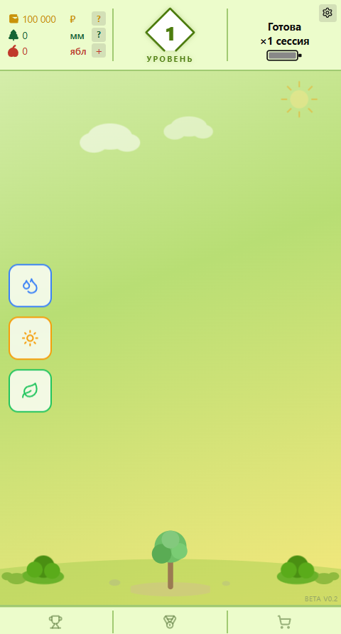
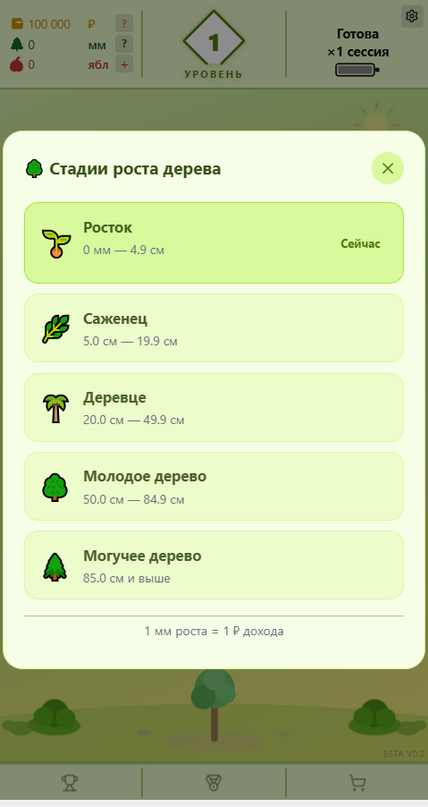

# Росток — Игровое банковское приложение

## Скриншоты

### Главный экран


### Стадии роста дерева


---

## Концепция продукта

### Что такое Росток?

Росток — это игровой интерфейс поверх накопительного счёта, созданный с разрешения клиента банка. Приложение отслеживает рост вклада и превращает ежедневный уход за капиталом в увлекательную игру: вы ухаживаете за виртуальным деревом, и оно растёт вместе с вашими накоплениями.

Идея простая: **Duolingo в мире накопительных счетов.** Так же, как языковое приложение превращает скучную учёбу в ежедневный ритуал — Росток превращает слежение за вкладом в привычку. Вы открываете приложение каждый день не потому что «надо», а потому что интересно посмотреть, как вырос ваш капитал и дерево.

В результате формируется финансовая дисциплина: привычка сберегать, регулярно пополнять вклад и следить за ростом накоплений, чтобы достигать своих финансовых целей.

---

### Три мини-игры каждый день

Каждая сессия состоит из трёх активностей. Можно проходить их в любом порядке — все три нужно выполнить, чтобы завершить сессию и получить доход.

- 💧 **Вода** — Капли падают сверху — двигайте корзину и ловите как можно больше. Чем выше процент попаданий, тем лучше результат.
- ☀️ **Свет** — Солнечные лучи появляются в случайных местах экрана — нажимайте на них пока не закончится время. Скорость решает.
- 🍃 **Листва** — Листочки падают сверху рядами — собирайте три одного цвета подряд. Чем длиннее серия, тем выше очки.

---

### Дерево растёт вместе с вами

По мере роста капитала дерево переходит через 5 стадий — от маленького ростка до большого дерева. Каждый миллиметр роста отражает реальный прирост вклада: чем больше накопленный доход, тем выше и пышнее дерево.

В конце каждой сессии дерево растёт в прямом эфире — вы видите анимацию роста и получаете яблоки (символы дохода), которые нужно собрать вручную. Это небольшой ритуал, который делает каждый день запоминающимся.

---

### Зачем возвращаться каждый день

- 🔥 Серия не прерывается — бонусный множитель держится на максимуме
- 🏆 Опыт и уровни за каждую сессию — таблица рейтинга среди всех игроков
- 📈 Сложный процент: доход каждый день начисляется на уже выросший капитал
- 🎯 Улучшение навыка: со временем мини-игры даются легче, бонус растёт

---

### Как начисляется доход

Доход делится на два вида: базовый и бонусный.

**🌿 Базовый — 12% годовых.** Начисляется каждый день автоматически — независимо от того, насколько хорошо вы сыграли. Это гарантированная часть дохода, которую вы получаете просто за то, что проводите сессию.

**⭐ Бонусный — до +3% годовых.** Зависит от вашего результата в мини-играх, размера капитала и регулярности сессий. Чем точнее играете и чем реже пропускаете — тем выше бонус. При длинной серии без пропусков бонусный множитель сохраняется на максимуме.

**⚡ Супер-сессия.** Пропущенные дни не сгорают: сессии накапливаются, и при следующем входе вы получите всё сразу — с повышенным множителем. Вернулись через три дня? Один вход закроет все пропуски.

> **О процентной ставке.** Текущие ставки (12% + до 3%) — тестовые, используются для демонстрации механики. В боевой версии ставки будут привязаны к реальным ставкам ЦБ РФ и условиям конкретного банка-партнёра.

---

### Как банки становятся партнёрами

Росток разработан как игровой слой поверх реального накопительного счёта. Банк-партнёр предоставляет API-доступ к счёту — с явного разрешения клиента — и игра начинает отслеживать реальный баланс вместо демонстрационного. Для клиента ничего не меняется: тот же вклад, тот же банк, но теперь с игровым интерфейсом.

1. **Клиент даёт разрешение.** При подключении клиент авторизует доступ к своему накопительному счёту через OAuth-протокол банка — по аналогии с открытым банкингом (Open Banking).
2. **Игра читает реальный баланс.** Росток подключается к API банка и отображает актуальный баланс вклада — дерево растёт вместе с настоящими накоплениями, доход начисляется по реальным ставкам банка.
3. **Банк получает вовлечённых клиентов.** Ежедневный ритуал в игре удерживает средства на счёте и снижает отток: клиент видит рост своих реальных накоплений каждый день и реже снимает деньги.

> **Для банков:** интеграция возможна через открытый API с OAuth 2.0. Росток работает с любым банком, предоставляющим API-доступ к накопительным счетам с разрешения клиентов — стандарт Open Banking / ПСД2-совместимые интерфейсы.

---

### Зачем это клиентам банка?

Большинство людей понимают, что копить важно — но редко делают это регулярно. Причина не в нехватке денег, а в отсутствии привычки и видимого прогресса.

- **🎯 Финансовая дисциплина через игру.** Игровой интерфейс формирует ежедневный ритуал: зайти, пройти мини-игры, увидеть рост дерева и капитала. Привычка складывается сама — без напоминаний и самодисциплины.
- **📈 Видимый прогресс мотивирует.** Дерево растёт, уровень повышается, капитал увеличивается — всё это видно каждый день. Наглядный результат мотивирует пополнять вклад и не снимать накопленное.

---

### Зачем это банкам?

Чем больше клиентов сберегают деньги — тем меньше средств выводится из системы. Это напрямую выгодно банку: стабильная база вкладчиков снижает потребность в дорогом привлечении ликвидности.

- 🏦 Больше вкладчиков, дольше держат деньги — банк получает стабильную и дешёвую ресурсную базу.
- 📱 Ежедневное присутствие клиента в приложении — ценный актив: внимание аудитории можно монетизировать через партнёрские предложения и финансовые продукты.
- 🤝 Лояльность и вовлечённость клиентов выше — игровой формат создаёт эмоциональную привязанность к бренду банка.

---

### Призыв к действию (CTA на лендинге)

Пройдите короткий туториал, выберите стартовый капитал и посадите своё первое дерево — это займёт меньше трёх минут.

---

## Обзор

pnpm workspace монорепозиторий на TypeScript. Основной продукт — **Росток** (`artifacts/bank-game`), геймифицированное банковское приложение. Игрок ухаживает за виртуальным деревом, которое растёт по мере роста вклада, и получает ежедневный доход от трёх мини-игр.

## Технический стек

- **Monorepo**: pnpm workspaces
- **Node.js**: 24
- **TypeScript**: 5.9
- **API framework**: Express 5
- **База данных**: PostgreSQL + raw `pg` pool (игровое состояние); Drizzle ORM (shared lib)
- **Аутентификация**: собственная сессионная авторизация (email + пароль, cookie-сессии через `SESSION_SECRET`)
- **Валидация**: Zod (`zod/v4`), `drizzle-zod`
- **API codegen**: Orval (из OpenAPI spec)
- **Сборка**: esbuild (CJS bundle)

## Основные команды

- `pnpm run typecheck` — полная проверка типов по всем пакетам
- `pnpm run build` — typecheck + сборка всех пакетов
- `pnpm --filter @workspace/api-spec run codegen` — регенерация API-хуков и Zod-схем из OpenAPI spec
- `pnpm --filter @workspace/db run push` — применить изменения схемы БД (только dev)
- `pnpm --filter @workspace/api-server run dev` — запустить API-сервер локально

## Архитектура банкового приложения

### Аутентификация
- Собственная сессионная авторизация (email + пароль), cookie-based
- Сессии управляются api-server; нужна переменная окружения `SESSION_SECRET`
- Vite dev proxy: `/api` → `http://localhost:8080`

### Database Schema (raw SQL, не Drizzle)
- `users` — учётные данные, никнейм
- `accounts` — балансы пользователя, дата старта, учёт начислений
- `game_state` — состояние сессии (флаги воды/солнца/удобрения, время последней сессии, накопленные награды, XP, уровень, серия, рост дерева, флаг прохождения туториала)
- `income_history` — журнал всех начислений

### Экономические формулы
- Ежедневное авто-начисление: `balance × 0.12 / 365`
- `storedSessions = 1 + missedSessions` — сессии накапливаются, не теряются
- Базовая награда: `(balance × 0.12 / 365 / 3) × storedSessions`
- Бонусная награда: `(balance × bonusPercent / 365 / 3) × bonusMultiplier × storedSessions`
  - `bonusPercent = 0.03 × min(skillPart + capitalPart + randomPart, 1)` (потолок 3%)
  - `bonusMultiplier = max(1 - missedSessions × 0.1, 0.1)` (деградирует только бонус, не база)
  - `skillPart = (avgSkillScore/80) × 0.75`; `capitalPart`: 0.16/0.18/0.20; `randomPart`: 0–0.04
- Супер-сессия: отображается при `storedSessions > 1`; кнопка и статус становятся красными

### Поток получения наград
1. Игрок завершает все 3 мини-игры (вода, солнце, листва)
2. Бэкенд вычисляет базовую + бонусную награды и сохраняет в `game_state`:
   - `pending_base_reward` NUMERIC
   - `pending_bonus_reward` NUMERIC
3. Фронтенд показывает кнопку **«Доход за сессию ×N»** (N = storedSessions)
4. Кнопка вызывает `POST /api/game/session/claimAll` — получает базу и бонус одним запросом
5. Награды хранятся в БД до получения (выживают перезагрузку страницы)

### State Flow
- API-first: всё состояние живёт в PostgreSQL, загружается при входе
- Оптимистичное офлайн-начисление при переходе через границу суток
- Одна 8-часовая перезарядка между сессиями
- Накопленные награды хранятся в БД, не только в памяти

### XP / Модальное окно рейтинга
- Две основные вкладки: **История** (журнал XP сессий) и **Рейтинг**
- Рейтинг сортируется по трём режимам: Сессий (streak), Опыта (XP), Роста (tree_growth_mm)
- Строка лидерборда: никнейм + «Ур.X» (без эмодзи огня, без дельты XP сессии)

### Визуальная система дерева
- 5 стадий роста (0–4), каждая с отдельным SVG и обрезанным `viewBox`
- Размеры контейнера растут по стадиям: [82×74] → [82×90] → [115×118] → [130×143] → [148×166] px
- SVG используют `preserveAspectRatio="xMidYMax meet"` — корень дерева привязан к низу контейнера
- Раскладка: `.game-tree-wrap` — `position:absolute; bottom:56px`, крона растёт вверх

---

## Туториал

### Обзор
Новые пользователи проходят обязательный туториал перед доступом к основной игре. Состояние хранится в поле `tutorial_done` таблицы `game_state` (по умолчанию `FALSE` для новых аккаунтов).

### Шаги туториала
```
welcome → intro → water → sun-intro → sun → fertilizer-intro → fertilizer → complete
```

| Шаг | Что происходит |
|-----|----------------|
| `welcome` | Карточка «Как ухаживать за деревом» с описанием трёх видов ухода |
| `intro` | Оверлей с подсказкой нажать кнопку 💧, кнопка пульсирует |
| `water` | Открывается мини-игра с водой (FallingGameWater) |
| `sun-intro` | Оверлей с подсказкой нажать ☀️ |
| `sun` | Открывается мини-игра с солнцем (ClickGameSun) |
| `fertilizer-intro` | Оверлей с подсказкой нажать 🍃 |
| `fertilizer` | Открывается мини-игра с листвой (FertilizerMatchGame) |
| `complete` | Финальная анимация → окно завершения → основная игра |

### Навигация в туториале
- Верхняя панель и нижний nav видны, но все элементы светло-зелёные и `pointer-events: none`
- Активна только нужная кнопка (пульсирует анимацией `tutorial-water-pulse`)
- Мини-игры открываются кнопками внизу, не через `handleStartSession` (реальная сессия не создаётся)

### Финальная анимация при завершении туториала
1. Fertilizer мини-игра завершена → 3 кнопки ✓ появляются (done-состояние)
2. Через 800 мс → ghost-кнопки влетают пружинной анимацией
3. Через 2200 мс → ghost-кнопки схлопываются к центру (`merging`)
4. Через 2700 мс → появляется кнопка-лопатка 🪄
5. Нажатие лопатки → карточка «Все три этапа пройдены!» плавно исчезает → через 300 мс открывается финальное окно «Обучение пройдено! 🌳»
6. Нажатие «Начать играть» или ✕ → финальное окно плавно исчезает → через 400 мс туториал завершается, основная игра становится полностью активной

### Ограничения туториала
- Виджет серии (streak widget) **не показывается** в первый день создания аккаунта (ни при старте, ни после туториала); начинает появляться со второго дня
- Кнопки активностей при `tutorialStep === "complete"` заблокированы — реальная сессия не может запуститься случайно
- `api.tutorialComplete()` вызывается только при закрытии финального окна

---

## UI-компоненты

### SettingsWidget
- Крайняя левая кнопка — колокольчик, открывает 5-дневный виджет серии (`showStreakWidget`)
- Виджет серии подавляется в туториале и в первый день аккаунта

### Ресурсы (яблоки)
- Кнопка `?` — информация о начислении
- Кнопка `+` — открывает окно достижений

### LevelUpAnimation
- Заголовок «Новое достижение!», фон `#ecfccb`, иконка дерева с `marginBottom:6px`

### Разделители
- Единый цвет `rgba(100, 160, 40, 0.55)` во всех модальных окнах и панелях

### Мини-игры
- 💧 **Вода** (FallingGameWater) — ловить падающие капли
- ☀️ **Свет** (ClickGameSun) — собирать солнечные лучи
- 🍃 **Листва** (FertilizerMatchGame) — собирать листочки в ряд по три (счётчик и результат отображают 🍃)

---

## Key Files

- `artifacts/bank-game/src/lib/engine.ts` — все формулы, константы, типы состояния
- `artifacts/bank-game/src/lib/api.ts` — API-клиент
- `artifacts/bank-game/src/pages/GamePage.tsx` — основной игровой UI и логика туториала
- `artifacts/bank-game/src/pages/OnboardingPage.tsx` — выбор начального капитала
- `artifacts/bank-game/src/components/TreeSVG.tsx` — стадии дерева, обрезка viewBox, STAGE_DIMS
- `artifacts/bank-game/src/components/SettingsWidget.tsx` — настройки + триггер колокольчика/серии
- `artifacts/bank-game/src/components/FertilizerMatchGame.tsx` — мини-игра листва (match-3)
- `artifacts/bank-game/src/components/ClickGameSun.tsx` — мини-игра солнце
- `artifacts/bank-game/src/components/FallingGameWater.tsx` — мини-игра вода
- `artifacts/api-server/src/routes/game.ts` — все игровые API-эндпоинты
- `artifacts/api-server/src/index.ts` — точка входа сервера + DB migrations (`runMigrations()`)

## Артефакты

| Artifact | Путь | Порт |
|----------|------|------|
| bank-game | `/bank/` | $PORT |
| api-server | — | 8080 |

## Пользовательские предпочтения

- README и комментарии в коде — на русском (за исключением названий файлов, архитектурных терминов и команд)
